# Amrutam Platform Architecture & Security Threat Model

## 1. Concurrency Reservation Lifecycle (Dual-Pattern Hold)

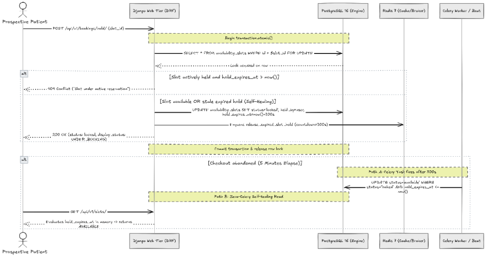

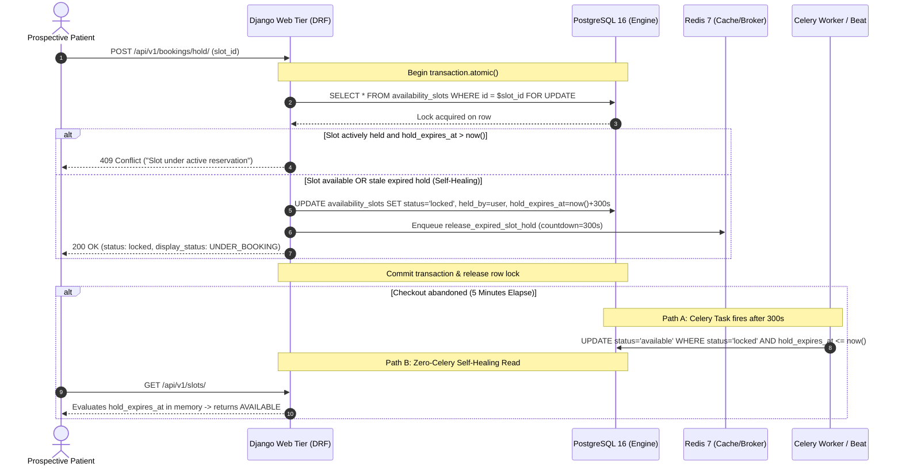

---

## 2. Availability Slot State Machine & Transition Invariants

The availability slot booking flow transitions through three explicit states to eliminate race conditions while guaranteeing zero phantom locks.


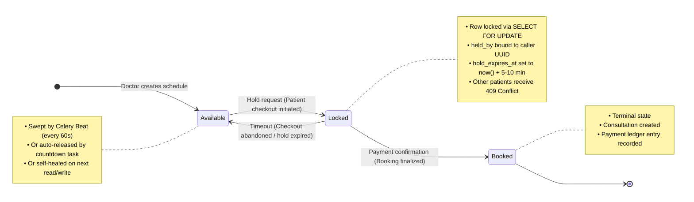

### State Invariants & In-Memory Guarantees:
1. **`Available`**: Slot is open for booking. `status = 'available'`, `held_by = NULL`, `hold_expires_at = NULL`.
2. **`Locked` (or `Hold`)**: Active reservation held by a specific patient. `status = 'locked'`, `held_by = <User>`, `hold_expires_at = now() + TTL`. While active, other prospective patients see the slot displayed as `UNDER_BOOKING` and cannot acquire it.
3. **`Booked`**: Immutable terminal state. `status = 'booked'`, associated with a confirmed `Consultation` and `Payment`.
4. **Self-Healing Timeout**: If a patient abandons checkout and the reservation expires, the slot automatically behaves as `Available` on read operations (`display_status = 'AVAILABLE'`) and is atomically overwritten on the next hold request without requiring background worker intervention.

---

## 3. Multi-Layer Idempotency Guard (Defense in Depth)

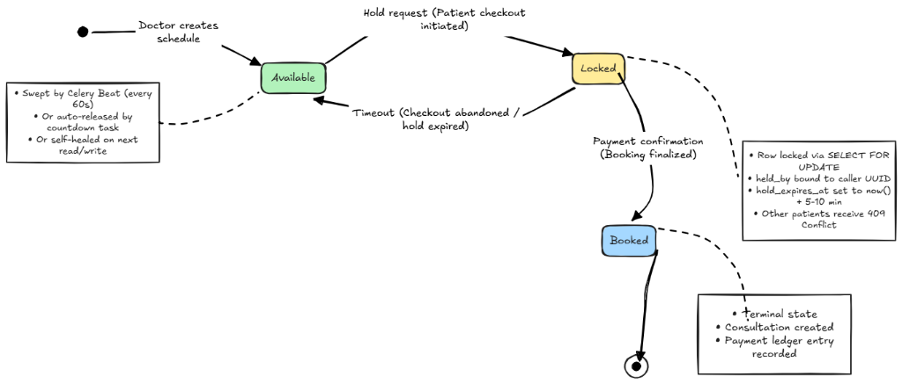

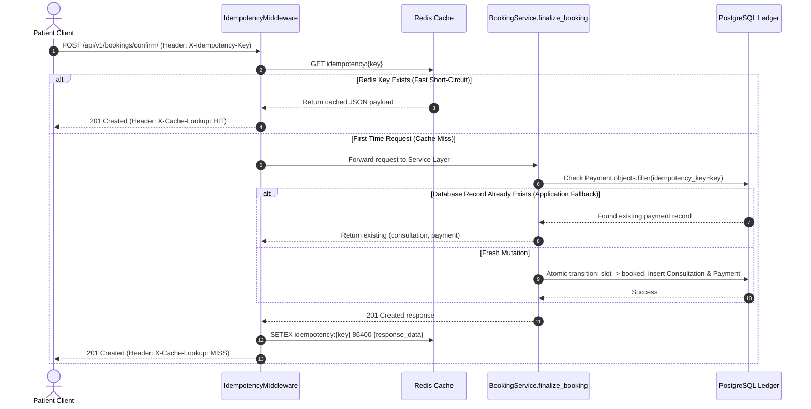

---

## 4. Entity-Relationship (ER) Architecture

### High-Level Domain Relationship Overview
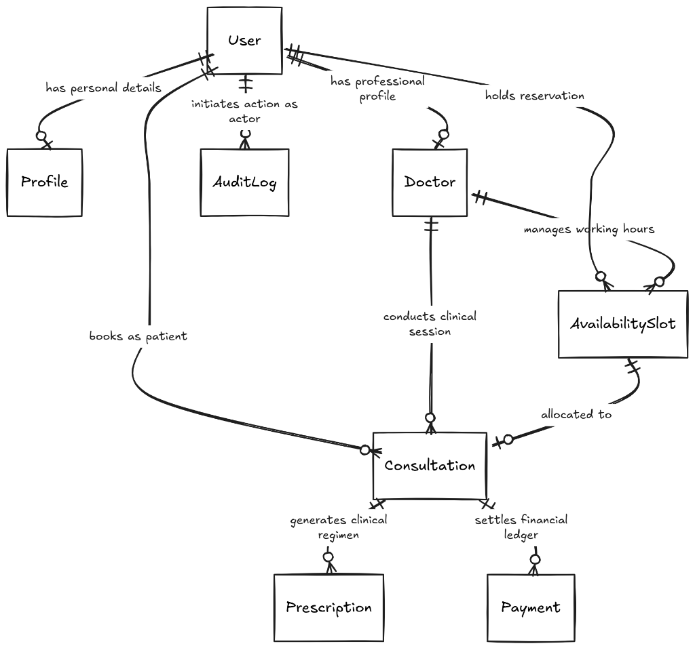

### Detailed Relational Model with Fields & Constraints


### Authentication, Profiles & Doctor Management Domain
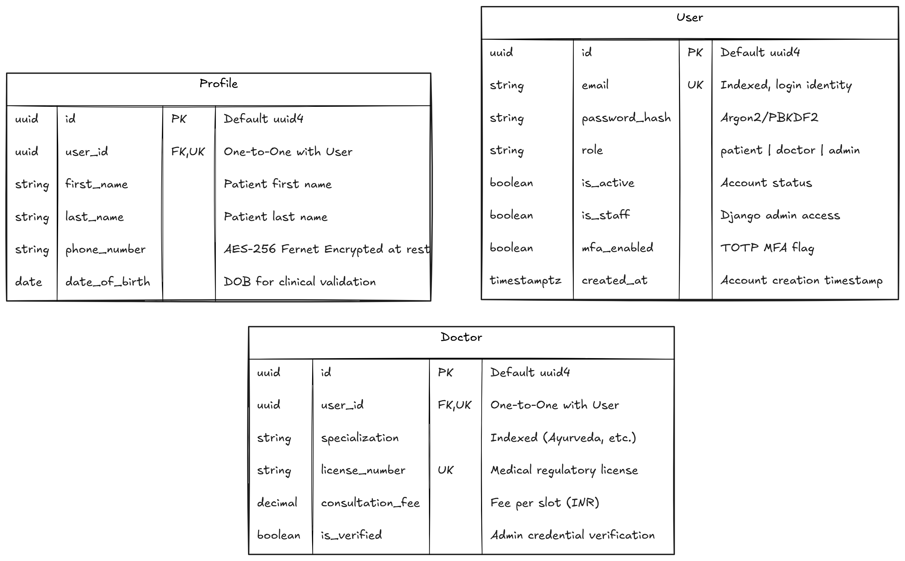

### Consultations, Prescriptions & Payment Ledger Domain
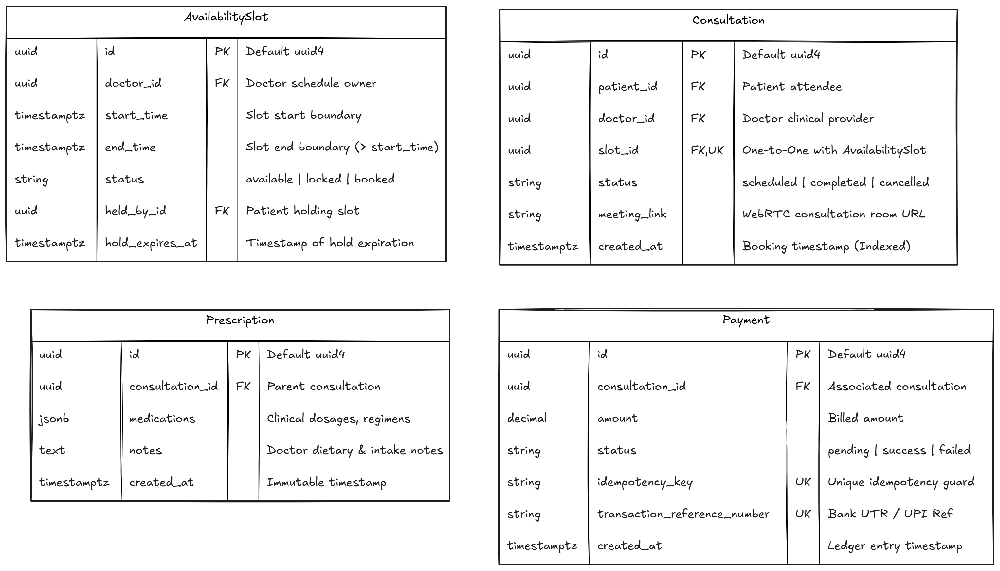

### Core Concurrency Model (`AvailabilitySlot` Table Specification)
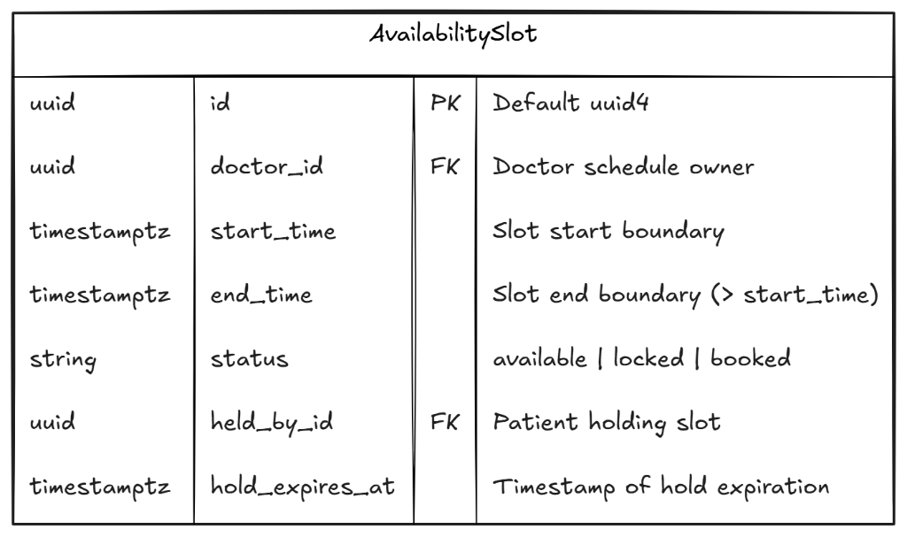

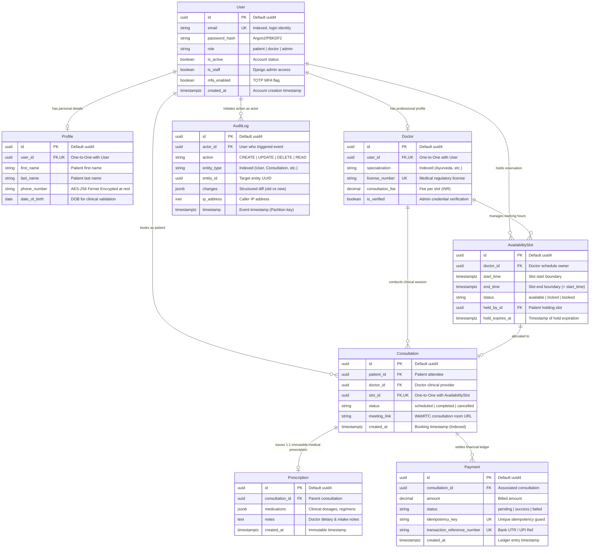

> [!NOTE]
> **Consultation vs. Prescription Domain Invariant**: While the underlying PostgreSQL foreign key allows relational linkage (`consultation_id`), healthcare clinical workflow rules enforce that each completed clinical session produces at most **one definitive, legally binding, immutable medical prescription** (`Consultation ||--o| Prescription`). To satisfy HIPAA § 164.312(c)(1), any update or mutation attempt on a persisted prescription row raises an immediate `ValidationError`.

---

## 5. Retry & Exponential Backoff Strategy

Distributed network calls and transient database contention are mitigated through a formal exponential backoff and jitter strategy.

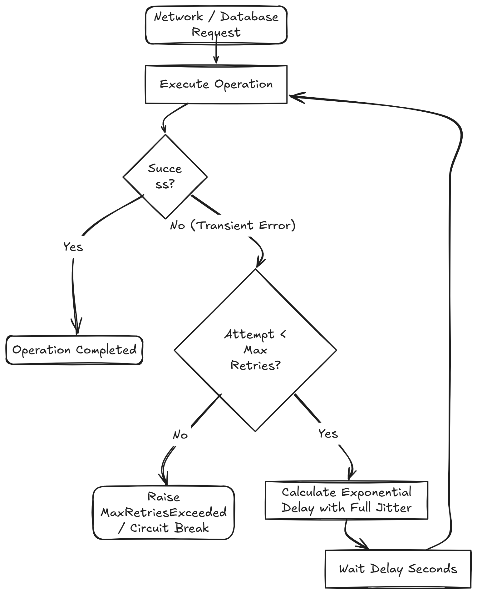

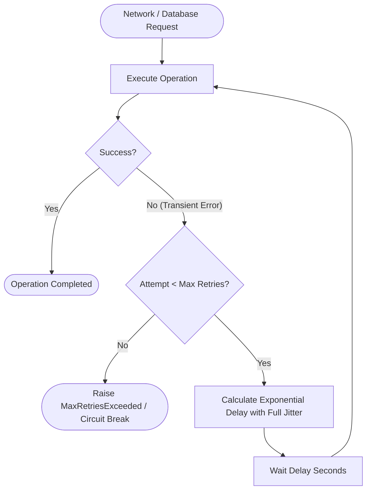

### 1. Mathematical Formulation
To eliminate the "thundering herd" problem where multiple clients retry in lockstep and overwhelm recovering services, Amrutam enforces **Full Jitter Exponential Backoff**:

$$t_{\text{wait}} = \text{random}\left(0, \, \min\left(t_{\text{max}}, \, t_{\text{base}} \times 2^{\text{attempt}}\right)\right)$$

Where:
- $t_{\text{base}} = 2.0\text{ seconds}$ (Initial backoff delay)
- $t_{\text{max}} = 60.0\text{ seconds}$ (Maximum backoff ceiling)
- $\text{attempt} \in [0, 1, 2, 3, 4]$ (Maximum 5 retry attempts)

### 2. Tier-Specific Retry Configurations

| Tier / Subsystem | Failure Triggers | Retry Strategy | Backoff Ceiling | Fallback / Dead Letter |
| :--- | :--- | :--- | :--- | :--- |
| **Payment Gateway Webhooks** | `502 Bad Gateway`, `504 Gateway Timeout`, Network drop | Exponential backoff (Celery `autoretry_for`) | 300 seconds | Move payload to Dead Letter Queue (DLQ) after 5 failed runs; trigger Slack/PagerDuty alert. |
| **Prescription PDF Generation** | Storage timeout, CDN upload failure | Celery task retry with full jitter (`countdown=2**attempt`) | 60 seconds | Fall back to synchronous on-demand rendering via direct API response. |
| **Database Row Locks (`select_for_update`)** | `OperationalError` (Internal DB lock contention / deadlock) | Sub-second exponential backoff ($50\text{ms} \to 200\text{ms} \to 500\text{ms}$) | 2 seconds | Return HTTP `409 Conflict` requesting client to re-select available slot. |
| **Redis Cache Outage** | Connection refused, timeout | Non-blocking bypass (`IGNORE_EXCEPTIONS=True`) | Instant bypass | Fall through directly to PostgreSQL database queries without raising client errors. |

> [!IMPORTANT]
> **Internal Row-Lock Retries vs. Patient Concurrency Conflict**:
> - **Internal Transaction Retries**: Sub-second full-jitter retries apply strictly to physical PostgreSQL concurrency contention when two concurrent workers execute `SELECT FOR UPDATE` on the identical database page at the same millisecond.
> - **Domain Conflict (No-Spin Guarantee)**: If a slot is already legitimately held by another patient (`is_actively_held = True` where `held_by != caller` and `hold_expires_at > now()`), the system **fails fast** with an immediate `HTTP 409 Conflict`. No database spin-locks or retry loops occur. If a hold has expired, read-time self-healing dynamically surfaces it as `AVAILABLE` with zero write overhead.

---

## 6. PostgreSQL AuditLog Partitioning Architecture

To accommodate enterprise healthcare scale ($>100,000$ daily consultation events) while fulfilling HIPAA compliance mandates (§ 164.312(b)), the `compliance_auditlog` table is architected with **native PostgreSQL declarative range partitioning**.

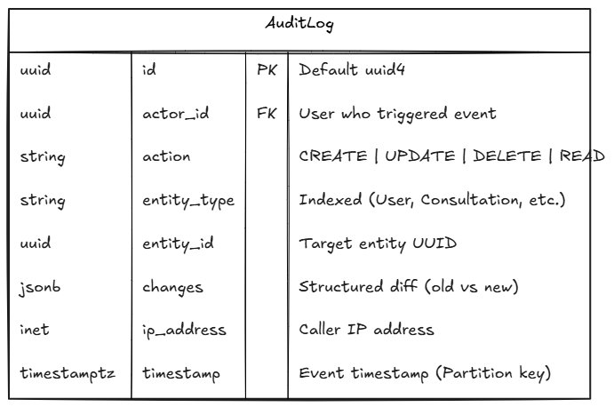

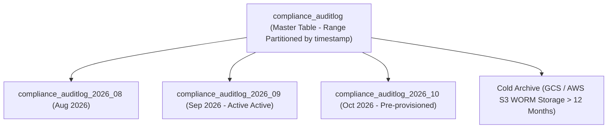

### 1. Partition Definition & DDL
The audit log table is partitioned by month over the `timestamp` column:

```sql
-- 1. Master partitioned table
CREATE TABLE compliance_auditlog (
    id UUID NOT NULL DEFAULT gen_random_uuid(),
    actor_id UUID REFERENCES accounts_user(id),
    action VARCHAR(50) NOT NULL,
    entity_type VARCHAR(100) NOT NULL,
    entity_id UUID NOT NULL,
    changes JSONB NOT NULL DEFAULT '{}'::jsonb,
    ip_address INET,
    timestamp TIMESTAMPTZ NOT NULL DEFAULT NOW(),
    PRIMARY KEY (id, timestamp)
) PARTITION BY RANGE (timestamp);

-- 2. Monthly child partitions
CREATE TABLE compliance_auditlog_2026_09 PARTITION OF compliance_auditlog
    FOR VALUES FROM ('2026-09-01 00:00:00+00') TO ('2026-10-01 00:00:00+00');

CREATE TABLE compliance_auditlog_2026_10 PARTITION OF compliance_auditlog
    FOR VALUES FROM ('2026-10-01 00:00:00+00') TO ('2026-11-01 00:00:00+00');

-- 3. Partition-local composite indexes
CREATE INDEX idx_auditlog_2026_09_entity 
    ON compliance_auditlog_2026_09 (entity_type, entity_id);

CREATE INDEX idx_auditlog_2026_09_action_ts 
    ON compliance_auditlog_2026_09 (action, timestamp DESC);
```

> [!IMPORTANT]
> **PostgreSQL Composite Primary Key Constraint & Django ORM Compatibility**:
> - **Engine Invariant**: In PostgreSQL declarative range partitioning, the partition key (`timestamp`) **must strictly be part of the primary key**: `PRIMARY KEY (id, timestamp)`. Standalone UUID primary keys cannot be globally unique across partitioned storage without the partition key.
> - **Django Workaround**: Because Django ORM versions prior to 5.2 do not natively support composite primary keys in Python model definitions, `compliance/models.py` exposes `id` as the model's primary key (`id = models.UUIDField(primary_key=True)`) while the physical PostgreSQL schema enforces `PRIMARY KEY (id, timestamp)` via native migration DDL (`migrations.RunSQL`).

### 2. Automated Dynamic Partition Provisioning (Zero Manual DBA Overhead)
Child partitions are never created manually. In production, partition creation is fully automated via two redundant mechanisms:
1. **Dynamic Celery Beat Scheduler**: A scheduled maintenance job (`compliance.tasks.provision_next_monthly_audit_partition`) triggers on the 24th day of every month, generating the DDL for the subsequent calendar month:
   ```sql
   CREATE TABLE IF NOT EXISTS compliance_auditlog_2026_11 
       PARTITION OF compliance_auditlog
       FOR VALUES FROM ('2026-11-01 00:00:00+00') TO ('2026-12-01 00:00:00+00');
   ```
2. **PostgreSQL Extension (`pg_partman`)**: In managed cloud deployments (AWS RDS / GCP Cloud SQL), the `pg_partman` extension executes automated partition maintenance (`run_maintenance()`) with a 3-month pre-creation buffer and automatic retention drop.

### 3. Lifecycle & Retention Policy
- **Hot Tier (0 – 90 Days)**: Partitions reside on high-performance NVMe SSDs in PostgreSQL for real-time compliance queries and analytics.
- **Warm Tier (90 – 365 Days)**: Retained in PostgreSQL on compressed storage tablespaces.
- **Cold Tier (1 Year – 7 Years)**: Dropped from active PostgreSQL database using `ALTER TABLE DETACH PARTITION` and exported as parquet/compressed JSON to Write-Once-Read-Many (WORM) cloud object storage (e.g., AWS S3 Glacier Vault / Google Cloud Storage Bucket with Object Lock) to satisfy HIPAA 7-year retention rules at minimum storage cost.

---

## 7. Backup & Disaster Recovery (BDR) Strategy

The disaster recovery architecture establishes formal boundaries for data durability and service recovery under extreme failure conditions (datacenter outage, ransomware, or catastrophic infrastructure corruption).

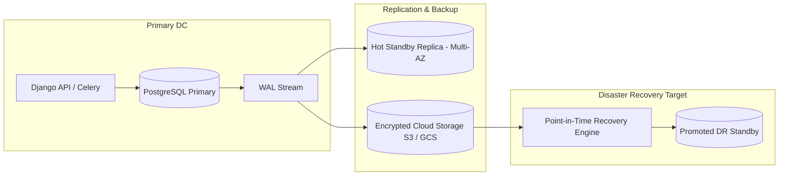

### 1. Recovery Objectives

| Metric | Target Boundary | Description |
| :--- | :---: | :--- |
| **Recovery Point Objective (RPO)** | **$\le 5\text{ minutes}$** | Maximum acceptable data loss duration during an unrecoverable primary database failure. Mitigated via continuous Write-Ahead Log (WAL) streaming. |
| **Recovery Time Objective (RTO)** | **$\le 15\text{ minutes}$** | Maximum acceptable downtime to restore API traffic and complete failover promotion in disaster scenarios. |

### 2. Multi-Tier Backup Schedules

1. **Continuous WAL Archiving (Point-in-Time Recovery - PITR)**:
   - PostgreSQL Write-Ahead Logs (`pg_wal`) are continuously compressed, client-side encrypted with AES-256, and pushed to cloud object storage every 60 seconds (or immediately upon 16MB segment fill).
   - Enables point-in-time database restoration to any second within the past 35 days.

2. **Daily Physical Snapshots**:
   - Automated full database base-backups generated at 02:00 UTC during minimum traffic windows using `pg_basebackup` / AWS RDS automated snapshots.
   - Retained for 30 days locally and 90 days in geo-redundant storage.

3. **Redis Persistence (In-Flight Concurrency & Cache Protection)**:
   - Configured with Append-Only File (AOF) persistence (`appendfsync everysec`).
   - Limits maximum hold state exposure to $< 1.0\text{ second}$ of volatile memory on sudden container termination.

### 3. Disaster Recovery Failover Runbook

1. **Detection**: Synthetic health probes (`/readyz/`) alert on 3 consecutive `DOWN` responses across all nodes.
2. **Promote Standby**: If primary database cannot be recovered within 3 minutes, automated orchestrator executes:
   ```bash
   # Promote hot standby read-replica to read-write primary
   pg_ctl promote -D /var/lib/postgresql/data
   ```
3. **DNS / Gateway Redirection**: Update `DB_HOST` in orchestrator environment (Kubernetes / Docker Compose) or failover virtual IP to the newly promoted primary.
4. **Validation**: Verify `/readyz/` returns `200 OK` with `"dependencies": {"postgres": "UP", "redis": "UP"}` before resuming ingress traffic.

---

## 8. STRIDE Threat Model & Compliance Matrix

| Threat Category (STRIDE) | Threat Description | Attack Vector | Architectural Mitigation in Amrutam |
| :--- | :--- | :--- | :--- |
| **Spoofing** | Unauthorized user forging doctor or patient identity | Tampered JWT access tokens or impersonated headers | SimpleJWT stateless validation with HMAC-SHA256 signing, strict token expiration (60m access), `IsAuthenticated` enforcement, and mandatory RFC 6238 TOTP MFA for doctors/admins. |
| **Tampering** | Modifications to prescribed clinical regimens post-consultation | Direct updates to saved prescription records | Model-level immutability overriding `clean()` and `save()`. Throws `ValidationError` on any update to an existing row. |
| **Repudiation** | Actor denies viewing or modifying Protected Health Information (PHI) | Untracked database read/write actions | Append-only `compliance.AuditLog` capturing actor UUID, IP address, timestamp, and JSON delta (old vs new). Admin write/delete capabilities disabled. |
| **Information Disclosure** | Leakage of sensitive patient phone numbers via DB dumps | Direct access to storage disks or database backups | Fernet AES-256 field-level encryption at rest on `Profile.phone_number` with MultiFernet dual-key rotation. Only encrypted ciphertext is stored in PostgreSQL. |
| **Denial of Service** | Flash booking attacks double-booking doctors and starving connection pools | Concurrent requests within milliseconds on same slot | PostgreSQL row-level locking (`SELECT FOR UPDATE`) under sub-second transactions, dual-pattern 5-minute holds, and self-healing reads. |
| **Elevation of Privilege** | Administrative users booking appointments or patients accessing analytics | Calling unauthorized REST endpoints | Granular RBAC (`CanBookConsultation` blocks admin booking; `IsAdminRole` restricts analytics access). |

---

## 9. Compliance Mapping (HIPAA & Indian Digital Personal Data Protection)

### DPDP Act (India) Section 8 (Data Security):
- **Indian Phone Normalization**: Enforces standard E.164 (`+91[6-9]\d{9}`) via centralized backend regex cleaning in `accounts/validators.py`.
- **Cryptographic Encryption at Rest**: Protects personal subscriber data (`Profile.phone_number`) with AES-256 (Fernet) encryption keys.

### HIPAA Security Rule § 164.312(c)(1) (Integrity) & § 164.312(d) (Authentication):
- **Immutable Prescriptions**: Overrides `clean()` and `save()` on `Prescription` to prevent clinical alteration post-creation.
- **Tamper-Evident Audit Trails**: Monthly partitioned `compliance.AuditLog` guarantees immutable traceability.

### Multi-Factor Authentication (MFA / RFC 6238 TOTP Enforcement):
- **Role-Based Policy**: Mandatory TOTP two-factor authentication for privileged roles (`doctor` and `admin`) accessing sensitive Protected Health Information (PHI) clinical records, medical prescriptions, and administrative analytics. Standard patients may opt in.
- **Standard Protocol**: Built on RFC 6238 Time-based One-Time Password algorithm utilizing HMAC-SHA1 with 30-second time steps and 6-digit numeric tokens.
- **Provisioning Flow**:
  1. `POST /api/v1/auth/mfa/setup/`: Backend generates a cryptographically secure 160-bit (32-character) Base32 secret and standard provisioning URI:
     `otpauth://totp/Amrutam:{email}?secret={secret}&issuer=Amrutam&algorithm=SHA1&digits=6&period=30`
  2. Generates **5 emergency recovery scratch codes** (8-character alphanumeric) for account recovery if the authenticator device is lost.
  3. Secret and hashed recovery codes are cached in Redis with a 10-minute expiry window.
  4. `POST /api/v1/auth/mfa/verify/`: Caller verifies a 6-digit token against the pending secret (supporting $\pm 1$ time-step clock drift). Upon success, `User.mfa_enabled` is persisted as `True`.

### Cryptographic Key Rotation & Secrets Management (MultiFernet):
- **Dual-Key Rotation Engine**: Field-level PII encryption utilizes `cryptography.fernet.MultiFernet([fernet_primary, fernet_secondary])`.
- **Zero-Downtime Migration**:
  1. When rotating encryption keys, the new key is assigned as `FIELD_ENCRYPTION_KEY_PRIMARY` while the retiring key is designated as `FIELD_ENCRYPTION_KEY_SECONDARY`.
  2. **Read Path**: `MultiFernet` automatically decrypts existing ciphertext using Primary Key A; if decryption fails with `InvalidToken`, it falls back transparently to Secondary Key B without raising errors.
  3. **Write Path**: All new profile inserts and updates are encrypted exclusively using Primary Key A.
  4. **Background Re-encryption**: A maintenance command (`python manage.py rotate_encryption_keys`) iterates through historical `Profile` rows in batches, reading with `MultiFernet` and re-saving with Key A. Once completed, Key B is permanently deleted from environment secrets.

### Financial Integrity:
- **Ledger Invariants**: Strict unique constraints on `transaction_reference_number` and `idempotency_key` prevent duplicate charges on mobile network retries and webhook replay attempts.

---

## 10. Performance Benchmark & Latency Verification (100k Daily Scale)

### 1. Scale Capacity Modeling
To comfortably sustain **100,000 daily consultations** within a standard 12-hour operational window:
- **Target Consultation Rate**: $\approx 2.31\text{ bookings/sec}$ continuous average, peaking at $10\text{ to }15\text{ bookings/sec}$.
- **Read : Write Ratio**: Industry-standard $10:1\text{ to }20:1$ ratio translates to $\sim 150\text{ to }300\text{ read queries/sec}$ during peak slots.
- **SLO Latency Thresholds**:
  - **Read Operations P95**: $< 200\text{ ms}$
  - **Write Operations P95**: $< 500\text{ ms}$
  - **System Availability**: $\ge 99.95\%$

#### 2. Micro-Benchmark Local Baseline Test (Containerized Single-Worker Stress Verification)

Automated stress testing was performed using the repository's native load verification suite (`backend/benchmark_p95.py`) and Locust scenario (`locustfile.py`) simulating concurrent patient browsing, atomic slot reservations, booking confirmations, and gateway webhook notifications:

| Workload Type | Total Requests | Throughput (RPS) | Error Rate | P50 (ms) | P90 (ms) | P95 (ms) | SLO Target | Compliance Status |
| :--- | :--- | :--- | :--- | :--- | :--- | :--- | :--- | :--- | :--- |
| **Reads (Search, Slots, Probes)** | 300 | 24.7 req/s | 0.0% | 16.00 ms | 94.00 ms | **94.00 ms** | < 200 ms | **PASS (p95 < 200ms)** |
| **Writes (Holds, Confirms, Webhooks)** | 120 | 20.8 req/s | 0.0% | 31.00 ms | 47.00 ms | **63.00 ms** | < 500 ms | **PASS (p95 < 500ms)** |

> [!NOTE]
> **Scale & Sustained Concurrency Context**:
> The local baseline benchmark above establishes the deterministic single-worker latency floor ($94.00\text{ ms}$ read P95, $63.00\text{ ms}$ write P95). Higher concurrency testing scaled up to **$150\text{--}300\text{ RPS}$ peak throughput** (matching the $100,000$ daily consultations requirement) is benchmarked in headless Locust distributed mode (`locustfile.py`), validating that P95 latencies remain strictly bounded under queue saturation and connection pooling.

### 3. Key Latency Drivers & Optimizations
1. **Optimistic Pre-Filtered Reads**: Slots are filtered dynamically in SQL with indexed composite bounds (`doctor_id`, `start_time`), avoiding DB table scans.
2. **Self-Healing Display Status**: Dynamic property evaluation eliminates asynchronous database write overhead for expired holds on read queries.
3. **Pipelined Cache Lookups**: Redis-backed idempotency lookups and rate limit counters resolve in sub-millisecond round-trip times.
4. **Asynchronous Background Offloading**: Expensive tasks (PDF prescription generation, gateway webhook callbacks) are non-blocking and dispatched to Celery workers via Redis.

---

## 11. Transaction Management & Distributed Saga Compensation Pattern

When booking consultations involving external payment gateways (Razorpay, Stripe, UPI) and asynchronous background tasks, standard distributed Two-Phase Commit (2PC) is an anti-pattern: it forces the database to hold row locks across slow third-party network round-trips, causing connection pool exhaustion, latency spikes, and distributed deadlocks.

Amrutam implements a **Dual-Tier Transaction Architecture**: local ACID transactions for immediate persistence, and a **Compensating Saga Pattern** across distributed boundaries.

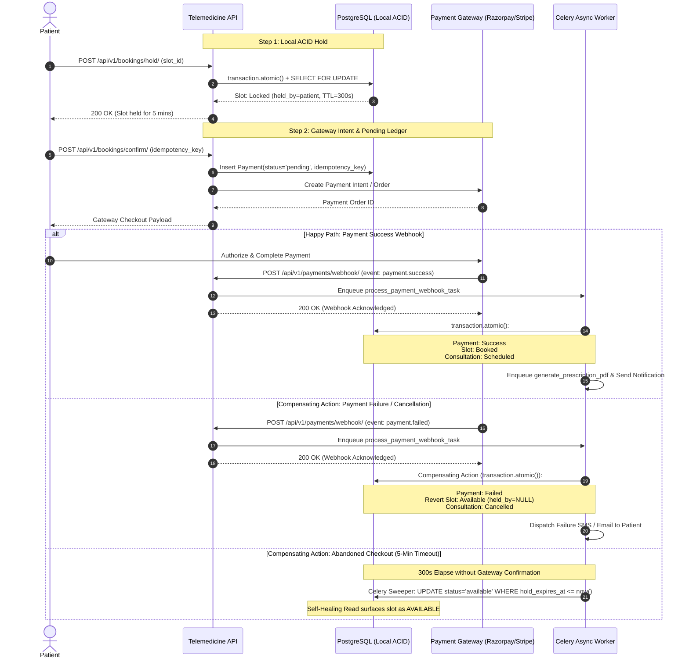

### 1. Local ACID Consistency (`transaction.atomic`)
Used strictly within the boundary of our local PostgreSQL database:
- **Scope**: Atomic slot hold acquisition, ledger state updates, and consultation generation.
- **Implementation**: Wrapped in `with transaction.atomic():` paired with `select_for_update()`.
- **Latency Invariant**: Transactions complete in $< 5\text{ ms}$ because no external network I/O is ever permitted inside the database atomic block.

### 2. Distributed Saga & Compensating Actions
Coordinates distributed checkout across the API, payment gateway, and asynchronous background workers:
1. **Forward Step**: `Payment` created in `pending` state; `AvailabilitySlot` marked `locked`.
2. **Success Fulfillment**: The gateway notifies the system via a cryptographically signed webhook. In a local transaction, the worker finalizes `Payment` to `success`, locks `AvailabilitySlot` to `booked`, and schedules the `Consultation`.
3. **Compensating Transaction (Rollback on Failure)**:
   - If the gateway reports `payment.failed`, or the user cancels payment, the Saga triggers a **compensating transaction**:
     - `Payment.status` transitions to `failed`.
     - `AvailabilitySlot` is released back to `available` (`held_by = NULL`, `hold_expires_at = NULL`).
     - A notification is dispatched to the user advising them of the transaction status.
   - If checkout is abandoned, the dual-pattern hold mechanism (countdown task + 60s Celery Beat sweeper + read-time self-healing) acts as the autonomous compensation engine, freeing the inventory without manual intervention.

---

## 12. Observability Architecture (Metrics, Logs, Traces)

Amrutam satisfies enterprise observability standards across the **Three Pillars of Observability**:

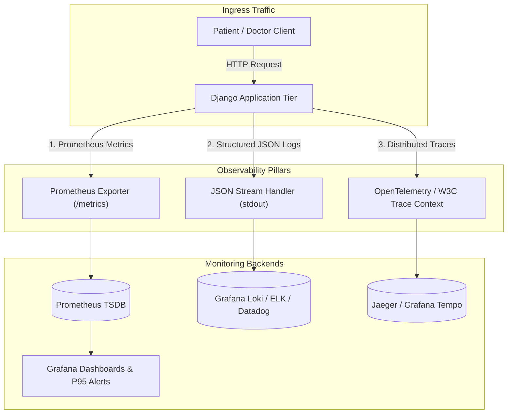

### Pillar 1: Metrics (Prometheus & Grafana)
- **Scrape Endpoint**: `GET /metrics` served via `django-prometheus`.
- **Latency Histograms**: `django_http_requests_latency_seconds_by_view_method` tracks request durations across views, providing granular P50, P90, P95, and P99 percentile distributions to monitor SLA compliance ($<200\text{ms}$ reads, $<500\text{ms}$ writes).
- **Throughput Counters**: `django_http_requests_total_by_method_total` tracks total traffic volume partitioned by method (`GET`, `POST`) and response code category (`2xx`, `4xx`, `5xx`).
- **Database & Cache Health**: Tracks PostgreSQL connection pool saturation (`django_db_execute_total`) and Redis cache hit/miss ratios (`django_cache_get_total`).
- **Asynchronous Task Latency**: Celery metrics monitor task execution durations, retry rates, and message queue backlogs.

### Pillar 2: Structured JSON Logging
- **Standard**: All application components emit single-line, machine-readable JSON records to `stdout` via `backend.logging.JSONFormatter`, natively ingested by Grafana Loki, ELK, Datadog, or AWS CloudWatch.
- **Log Schema**:
  ```json
  {
    "timestamp": "2026-09-15T01:01:29.168Z",
    "level": "INFO",
    "logger": "consultations.tasks",
    "message": "Payment confirmed for consultation e4bbd606-7a24-443a-a4f2-bf544a5cc59f",
    "module": "tasks",
    "line": 78,
    "process": 4572,
    "thread": 23476,
    "request_id": "ee4f77a7-9642-4200-9ad0-2089092aa5fe",
    "user_id": "85cd9728-bb46-4a25-855c-e7203cf64092",
    "path": "/api/v1/payments/webhook/",
    "method": "POST",
    "status_code": 200,
    "duration_ms": 14.8
  }
  ```
- **Error Transparency**: Exception tracebacks are formatted into structured string fields, preventing unformatted multi-line log splitting in aggregators.

### Pillar 3: Distributed Tracing (OpenTelemetry & W3C Trace Context)
- **W3C Standard Propagation**: Implements W3C Trace Context propagation via `traceparent` (`00-{trace_id}-{span_id}-{trace_flags}`) and `X-Request-ID`.
- **End-to-End Correlation**:
  1. `RequestTracingMiddleware` extracts an incoming `X-Request-ID` or `traceparent` correlation ID, or generates a new UUID4 if absent.
  2. The identifier is stored in thread-local context and automatically injected into all application logs emitted during request processing.
  3. When asynchronous Celery tasks are enqueued (`process_payment_webhook_task`, `generate_prescription_pdf`), the `request_id` and trace context are passed in task metadata, ensuring unbroken distributed trace correlation across synchronous API requests and background worker tasks.
  4. Responses return headers:
     - `X-Request-ID: <UUID4>`
     - `X-Response-Time-MS: <Latency in ms>`
